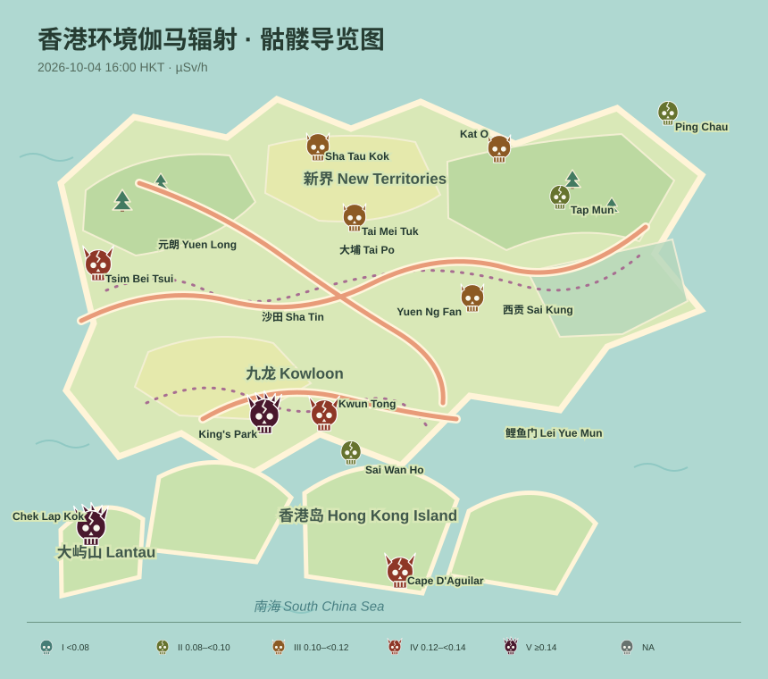

# Hong Kong environmental gamma radiation: a skull scale



This project turns a small, usually invisible natural phenomenon into an interactive map: the ambient gamma radiation dose rate measured around Hong Kong. Gamma radiation is part of the natural background environment. Its value changes slightly with local rock and soil, and can also change temporarily with weather, especially rainfall. I chose it because a number such as `0.12 µSv/h` is difficult to feel spatially, while a map makes it possible to compare twelve distant places at once without suggesting that a normal background reading is an emergency.

The measurements come from the [Hong Kong Observatory Radiation Monitoring Network](https://www.hko.gov.hk/en/radiation/monitoring/). The raw HKO reply is committed unchanged at `data/rmn_hourly_mean_used.txt`. It contains one header naming the observation interval, followed by twelve station rows. Each row has a station code and 25 hourly mean ambient gamma dose-rate values, in microsieverts per hour (µSv/h). Building the page remains offline and uses this bundled cache. In the page, **Refresh latest** fetches the current hourly station CSV from HKO when a network connection is available.

To inspect older readings, choose a month and select **Load month**. The page retrieves daily hourly snapshots from the [DATA.GOV.HK archive](https://data.gov.hk/en-data/dataset/hk-hko-rss-hourly-ambient-gamma-radiation-level-in-hong-kong), then the date field filters the selected day. The archive starts around 26 June 2025 and is available through yesterday; the live refresh supplies newer readings. Downloaded months are saved in the browser for later offline use. A month not previously loaded still requires a connection.

The interactive page is a zoomable, draggable illustrated guide map of Hong Kong, with playful park-like terrain and spooky details. Choose hourly readings, daily means, monthly means, or a mean for the complete cached period; use the range control to select the resulting time group. Station skull shape, size, and color encode five dose-rate tiers, with darker and larger skulls indicating higher readings. Hover over a station for its exact value. The number under the control repeats the average across all reporting stations, with the unit visible.

This representation makes local differences visible, but it hides precision. The five skull tiers group continuous readings into broader ranges; exact station values remain available on hover. Daily and longer summaries also discard hour-to-hour changes, and the illustrated map is for orientation rather than navigation or boundary decisions. The HKO data are provisional and a missing value is shown as `NA`, never invented.

To build the bundled offline page and README preview:

```bash
uv run plot.py
```

Open `site/index.html` in a browser after the build. To make a fresh, separate cache on another day, delete the existing raw file yourself and run `uv run fetch.py` once before building.
